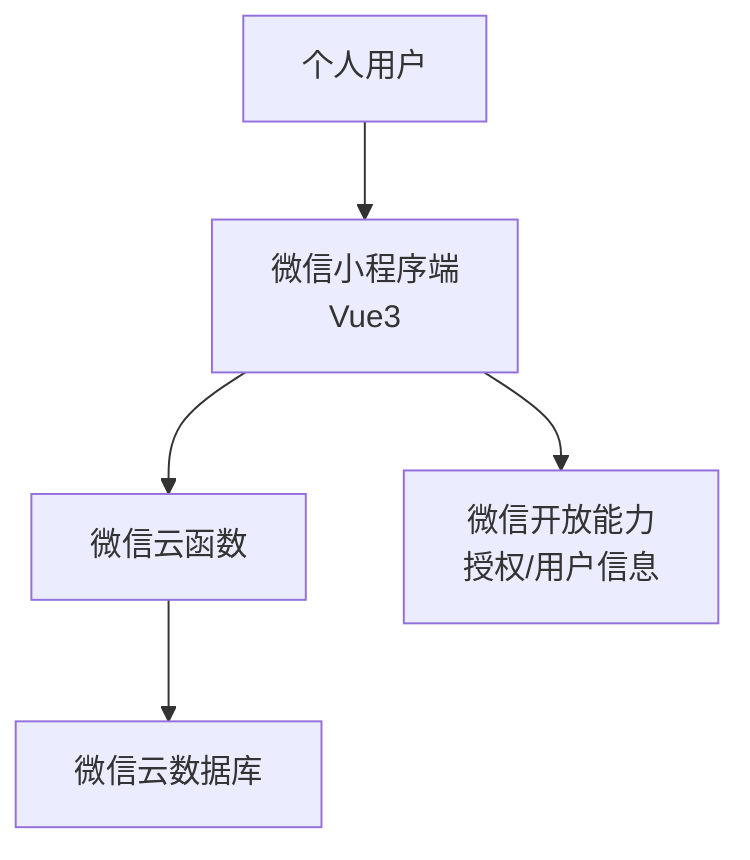
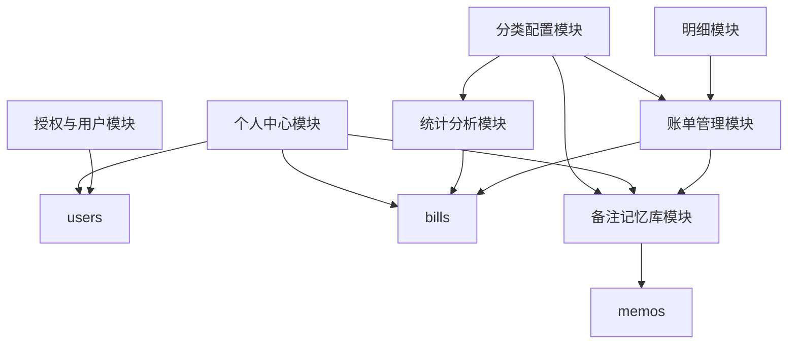
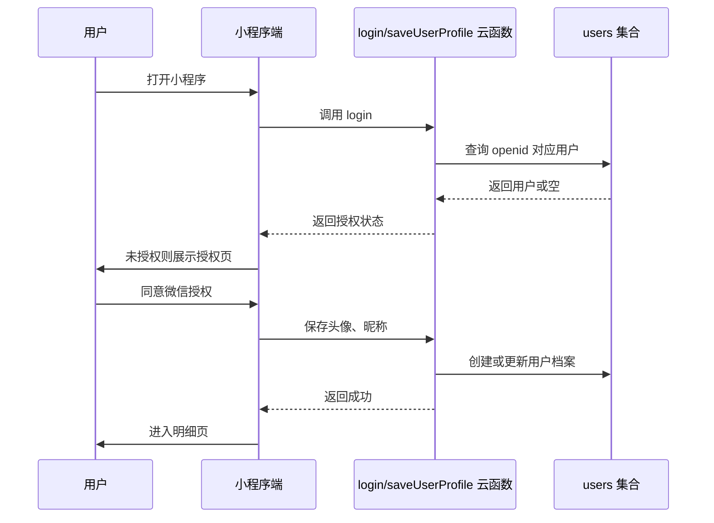
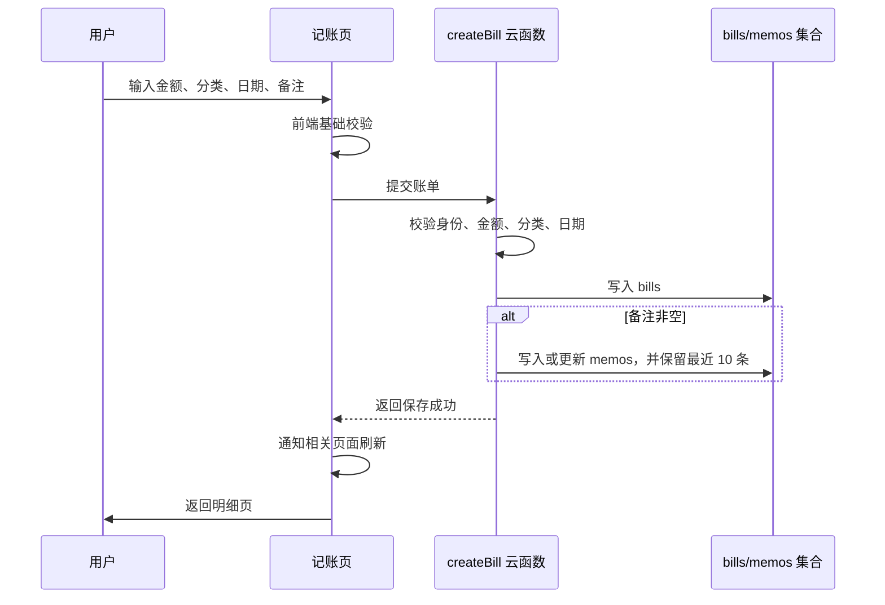

# 个人记账小程序概要设计文档

## 1. 文档信息

| 项目 | 内容 |
|---|---|
| 产品名称 | 个人记账小程序 |
| 文档类型 | 概要设计文档 |
| 当前版本 | V1.0 |
| 需求来源 | `doc/proposal.md` |
| 适用端 | 微信小程序 |
| 技术选型 | 微信小程序开发、Vue3、微信云开发、云函数、云数据库 |

---

## 2. 设计目标

本概要设计用于承接需求文档，明确系统模块划分、模块职责、模块关系、核心数据结构和云端接口边界，为后续详细设计与开发实现提供依据。

V1.0 重点完成个人记账闭环：

> 微信授权进入 → 新增账单 → 查看明细 → 查看统计 → 查看预算 → 使用备注记忆库提升记账效率

本设计不包含 UI 视觉规范、页面样式细节、复杂账户体系、多账本、多人协作、数据导出、周期记账、自定义分类等后续能力。

---

## 3. 技术架构

### 3.1 总体架构

系统采用微信小程序前端 + 微信云开发后端的轻量架构。



### 3.2 分层设计

| 层级 | 技术/载体 | 职责 |
|---|---|---|
| 表现层 | 微信小程序页面、Vue3 组件 | 页面展示、用户交互、表单校验、状态反馈 |
| 状态与业务层 | Vue3 Composition API / Store | 页面状态、业务计算编排、跨页面数据刷新 |
| 云函数层 | 微信云函数 | 身份校验、数据读写、聚合统计、批量操作 |
| 数据层 | 微信云数据库 | 用户、账单、备注记忆库等数据持久化 |
| 外部能力层 | 微信开放接口 | 获取用户 openid、头像、昵称等授权信息 |

### 3.3 关键设计原则

1. 前端负责交互体验、基础输入校验和页面状态管理。
2. 云函数负责用户身份绑定、数据权限控制、关键写入校验和统计聚合。
3. 所有用户数据必须按 `openid` 隔离，避免跨用户读取或写入。
4. 分类为系统内置静态配置，V1.0 不提供云端自定义分类能力。
5. 统计数据优先通过云函数按需计算，避免 V1.0 维护复杂冗余统计表。
6. 删除和清空类操作必须由前端二次确认，云函数仍需做权限校验。

---

## 4. 模块划分

### 4.1 模块总览

| 模块 | 位置 | 核心职责 |
|---|---|---|
| 授权与用户模块 | 前端 + 云函数 + 云数据库 | 微信授权、用户档案创建、登录态判断 |
| 账单管理模块 | 前端 + 云函数 + 云数据库 | 新增、编辑、删除、查询账单 |
| 明细模块 | 前端 + 云函数 | 按年月查询账单、按日期分组、展示月收入/月支出 |
| 统计分析模块 | 前端 + 云函数 | 月度汇总、分类占比、近七日收支、拓展统计 |
| 个人中心模块 | 前端 + 云函数 | 用户信息、坚持记账天数、预算进度、清空数据 |
| 备注记忆库模块 | 前端 + 云函数 + 云数据库 | 备注自动沉淀、手动新增、编辑、删除、按分类查询 |
| 分类配置模块 | 前端静态配置 | 支出/收入默认分类、图标、颜色、排序 |
| 公共基础模块 | 前端 | 日期、金额、校验、错误提示、云函数调用封装 |

---

## 5. 前端模块设计

### 5.1 页面结构

| 页面 | 路由建议 | 所属模块 | 说明 |
|---|---|---|---|
| 授权页 | `/pages/auth/index` | 授权与用户模块 | 首次进入或未授权时展示 |
| 明细页 | `/pages/detail/index` | 明细模块 | 默认首页，展示账单明细 |
| 统计页 | `/pages/statistics/index` | 统计分析模块 | 展示月度统计和近七日收支 |
| 我的页 | `/pages/profile/index` | 个人中心模块 | 展示用户、预算、记忆库入口 |
| 记账页 | `/pages/bill-edit/index` | 账单管理模块 | 新增和编辑账单复用 |

### 5.2 前端目录建议

```text
src/
  pages/
    auth/
    detail/
    statistics/
    profile/
    bill-edit/
  components/
    FloatingBillButton/
    MonthPicker/
    ConfirmDialog/
    EmptyState/
  stores/
    userStore.ts
    billStore.ts
  services/
    cloud.ts
    userService.ts
    billService.ts
    statsService.ts
    memoService.ts
  constants/
    categories.ts
  utils/
    date.ts
    money.ts
    validator.ts
```

### 5.3 前端状态设计

| 状态 | 建议归属 | 说明 |
|---|---|---|
| 当前用户信息 | `userStore` | openid、昵称、头像、授权状态 |
| 当前明细月份 | 明细页局部状态 | 控制明细列表和月汇总查询 |
| 当前统计月份 | 统计页局部状态 | 控制月度统计查询 |
| 账单编辑草稿 | 记账页局部状态 | 金额、类型、分类、日期、备注 |
| 全局刷新标记 | `billStore` 或事件机制 | 账单变更后通知明细、统计、我的页刷新 |

---

## 6. 云函数模块设计

### 6.1 云函数总览

| 云函数 | 职责 | 主要调用方 |
|---|---|---|
| `login` | 获取 openid，创建或返回用户档案 | 授权页、应用启动 |
| `saveUserProfile` | 保存微信昵称、头像、首次授权时间 | 授权页 |
| `createBill` | 新增账单，并自动沉淀备注 | 记账页 |
| `updateBill` | 编辑账单，并自动沉淀备注 | 记账页 |
| `deleteBill` | 删除单条账单 | 记账页 |
| `listBillsByMonth` | 查询指定年月账单和月收入/月支出 | 明细页 |
| `getStatistics` | 查询统计页所需聚合数据 | 统计页 |
| `getProfileSummary` | 查询个人中心汇总数据 | 我的页 |
| `clearBills` | 清空当前用户全部账单 | 我的页 |
| `listMemos` | 按类型/分类查询备注记忆 | 记账页、我的页 |
| `createMemo` | 手动新增备注 | 记忆库弹窗 |
| `updateMemo` | 编辑备注 | 记忆库弹窗 |
| `deleteMemo` | 删除备注 | 记忆库弹窗 |

### 6.2 云函数通用处理规则

1. 云函数通过微信云开发上下文获取当前 `openid`，不信任前端传入的 `openid`。
2. 所有数据库查询必须携带当前用户 `openid` 条件。
3. 写入账单时需校验金额、类型、分类、日期合法性。
4. 金额统一按分存储或 Decimal 字符串存储，避免浮点误差。
5. 删除、清空等操作只处理当前用户数据。
6. 云函数返回结构保持一致：

```ts
type CloudResult<T> = {
  success: boolean
  data?: T
  errorCode?: string
  message?: string
}
```

---

## 7. 数据库设计

### 7.1 集合总览

| 集合 | 说明 |
|---|---|
| `users` | 用户档案 |
| `bills` | 账单记录 |
| `memos` | 备注记忆库 |

### 7.2 `users` 集合

| 字段 | 类型 | 说明 |
|---|---|---|
| `_id` | string | 云数据库文档 ID |
| `openid` | string | 微信用户唯一标识 |
| `nickName` | string | 微信昵称 |
| `avatarUrl` | string | 微信头像 |
| `authorized` | boolean | 是否已完成授权 |
| `firstAuthorizedAt` | Date | 首次授权时间 |
| `createdAt` | Date | 创建时间 |
| `updatedAt` | Date | 修改时间 |

索引建议：

| 字段 | 类型 | 说明 |
|---|---|---|
| `openid` | 唯一索引 | 快速定位当前用户 |

### 7.3 `bills` 集合

| 字段 | 类型 | 说明 |
|---|---|---|
| `_id` | string | 账单 ID |
| `openid` | string | 所属用户 |
| `type` | string | `expense` / `income` |
| `amount` | number | 金额，建议以分为单位保存 |
| `categoryCode` | string | 分类编码 |
| `categoryName` | string | 分类名称冗余，便于展示 |
| `billDate` | string | 账单归属日期，格式 `YYYY-MM-DD` |
| `billMonth` | string | 账单归属月份，格式 `YYYY-MM` |
| `remark` | string | 备注，可为空 |
| `createdAt` | Date | 创建时间 |
| `updatedAt` | Date | 修改时间 |

索引建议：

| 字段 | 类型 | 说明 |
|---|---|---|
| `openid + billMonth + billDate` | 组合索引 | 明细页按月查询、按日期排序 |
| `openid + type + billMonth` | 组合索引 | 月度收入/支出统计 |
| `openid + billDate` | 组合索引 | 近七日收支统计 |

### 7.4 `memos` 集合

| 字段 | 类型 | 说明 |
|---|---|---|
| `_id` | string | 备注 ID |
| `openid` | string | 所属用户 |
| `type` | string | `expense` / `income` |
| `categoryCode` | string | 分类编码 |
| `categoryName` | string | 分类名称冗余 |
| `content` | string | 备注内容 |
| `lastUsedAt` | Date | 最近使用时间 |
| `createdAt` | Date | 创建时间 |
| `updatedAt` | Date | 修改时间 |

索引建议：

| 字段 | 类型 | 说明 |
|---|---|---|
| `openid + type + categoryCode` | 组合索引 | 查询指定分类备注 |
| `openid + type + categoryCode + content` | 唯一约束逻辑 | 防止同分类重复备注 |
| `openid + type + categoryCode + lastUsedAt` | 组合索引 | 保留最近 10 条 |

---

## 8. 分类配置设计

分类不进入数据库，作为前端和云函数共享的静态配置。云函数在写入账单和备注时需校验分类是否在配置中存在。

### 8.1 支出分类

| 编码 | 名称 |
|---|---|
| `expense_food` | 餐饮 |
| `expense_transport` | 交通 |
| `expense_shopping` | 购物 |
| `expense_housing` | 住房 |
| `expense_entertainment` | 娱乐 |
| `expense_medical` | 医疗 |
| `expense_education` | 教育 |
| `expense_communication` | 通讯 |
| `expense_social` | 人情 |
| `expense_other` | 其他 |

### 8.2 收入分类

| 编码 | 名称 |
|---|---|
| `income_salary` | 工资 |
| `income_bonus` | 奖金 |
| `income_parttime` | 兼职 |
| `income_investment` | 投资 |
| `income_redpacket` | 红包 |
| `income_reimburse` | 报销 |
| `income_other` | 其他 |

---

## 9. 模块关系

### 9.1 模块依赖关系



### 9.2 关系说明

| 关系 | 说明 |
|---|---|
| 授权与用户模块 → 全部业务模块 | 未授权用户不能进入主业务页面；业务数据均依赖当前用户身份 |
| 账单管理模块 → 明细模块 | 账单新增、编辑、删除后，明细列表和月汇总需要刷新 |
| 账单管理模块 → 统计分析模块 | 账单变更后，月度统计、分类占比、近七日收支需要重新计算 |
| 账单管理模块 → 个人中心模块 | 账单变更后，坚持记账天数、预算进度、预算剩余需要更新 |
| 账单管理模块 → 备注记忆库模块 | 保存账单时，如果备注非空，应自动沉淀到对应分类的记忆库 |
| 记忆库模块 → 记账页 | 记账页选择分类后，展示该分类下历史备注并支持快捷填入 |
| 分类配置模块 → 账单/记忆库/统计 | 分类用于账单校验、备注分组、统计聚合和展示 |

---

## 10. 核心业务流程

### 10.1 首次授权流程



### 10.2 新增账单流程



### 10.3 编辑/删除账单流程

| 操作 | 流程 |
|---|---|
| 编辑账单 | 明细页点击账单 → 进入记账页编辑模式 → 回显账单 → 提交修改 → 云函数校验归属与字段 → 更新账单 → 必要时更新备注记忆库 → 返回明细页 |
| 删除账单 | 编辑页点击删除 → 前端二次确认 → 调用删除云函数 → 云函数校验归属 → 删除账单 → 返回明细页并刷新相关统计 |

### 10.4 查看统计流程

1. 统计页加载当前月份。
2. 前端调用 `getStatistics`，传入统计月份。
3. 云函数查询当前用户账单，计算月收入、月支出、月结余、支出分类排行、最大单笔支出、记账笔数、记账天数。
4. 云函数额外按自然日查询最近七日收支，该数据不受统计月份影响。
5. 前端接收聚合结果并展示。

### 10.5 清空全部账单流程

1. 用户在个人中心点击清空全部账单数据。
2. 前端弹出二次确认。
3. 用户确认后调用 `clearBills`。
4. 云函数删除当前用户 `bills` 集合下全部账单。
5. 前端刷新明细、统计和个人中心为空状态。
6. 备注记忆库是否清空按 V1.0 需求理解不包含在“账单数据”内，默认不清空备注；如产品后续要求可调整。

---

## 11. 统计口径设计

| 指标 | 计算口径 |
|---|---|
| 月收入 | 指定月份 `type = income` 的账单金额之和 |
| 月支出 | 指定月份 `type = expense` 的账单金额之和 |
| 月结余 | 月收入 - 月支出 |
| 预算进度 | 本月支出 / 本月收入；收入为 0 时不计算 |
| 预算剩余 | 本月收入 - 本月支出；小于 0 时展示超支 |
| 坚持记账天数 | 当前用户所有账单中不同 `billDate` 的数量 |
| 本月记账笔数 | 指定月份全部账单数量 |
| 本月记账天数 | 指定月份不同 `billDate` 的数量 |
| 分类占比 | 指定支出分类金额 / 指定月份总支出 |
| 近七日收支 | 从当天起向前 7 天，每天收入和支出分别求和 |

金额计算建议：

1. 数据库存储使用整数分，展示时格式化为元并保留两位小数。
2. 前端计算器可使用字符串或整数分进行中间计算，避免浮点精度问题。
3. 云函数返回给前端的金额可同时包含 `amount` 和 `displayAmount`，实际以后端整数值为准。

---

## 12. 数据权限与安全设计

1. 云函数使用 `cloud.getWXContext()` 获取 `OPENID`。
2. 前端不得传递或覆盖 `openid`。
3. `users`、`bills`、`memos` 集合的读写均按当前 `openid` 过滤。
4. 编辑、删除账单前必须确认目标账单属于当前用户。
5. 编辑、删除备注前必须确认目标备注属于当前用户。
6. 清空数据只清空当前用户账单。
7. 用户头像和昵称仅用于个人中心展示，不用于其他用途。
8. 云数据库权限建议设置为仅云函数可写，必要的读取也优先通过云函数完成。

---

## 13. 异常处理设计

| 场景 | 前端处理 | 云函数处理 |
|---|---|---|
| 未授权 | 停留授权页并提示 | 返回未授权状态 |
| 授权失败 | 提示重新授权 | 返回错误码 |
| 未输入金额 | 阻止提交并提示 | 二次校验 |
| 金额为 0 或负数 | 阻止提交并提示 | 二次校验 |
| 金额超过上限 | 阻止提交并提示 | 二次校验 |
| 未选择分类 | 阻止提交并提示 | 校验分类合法性 |
| 重复点击保存 | 禁用保存按钮或 loading | 可通过幂等标识后续增强 |
| 删除账单 | 二次确认 | 校验归属后删除 |
| 清空全部账单 | 二次确认 | 仅删除当前用户数据 |
| 无数据 | 展示空状态 | 返回空数组和零值统计 |
| 云函数失败 | Toast 或错误提示 | 返回统一错误结构 |

---

## 14. 非功能设计

### 14.1 性能

1. 明细页按月份查询，避免一次性加载全部账单。
2. 账单查询按 `billMonth` 和 `billDate` 建索引。
3. 统计页由云函数聚合后返回，减少前端多次请求。
4. 近七日收支只查询 7 天范围数据。
5. 备注记忆库按类型和分类查询，每个分类最多保留 10 条。

### 14.2 可维护性

1. 分类配置集中维护，前端和云函数保持同一份编码规则。
2. 云函数按业务能力拆分，避免单个大函数过度膨胀。
3. 日期、金额、校验逻辑沉淀到公共工具模块。
4. 页面只负责展示与交互，复杂聚合交给云函数。

### 14.3 兼容性

1. 面向常见微信小程序运行环境。
2. 页面数据刷新通过生命周期和全局刷新标记实现，避免依赖浏览器特性。
3. 弹窗、选择器、授权能力优先使用微信小程序官方能力。

---

## 15. 后续扩展预留

| 扩展方向 | 预留建议 |
|---|---|
| 自定义分类 | 将分类从静态配置迁移到 `categories` 集合，账单仍保留 `categoryCode` |
| 多账本 | 在 `bills`、`memos` 中增加 `bookId` 字段 |
| 数据导出 | 新增导出云函数，按月份或全部账单生成文件 |
| 周期记账 | 新增周期规则集合和定时触发云函数 |
| 手动预算 | 新增 `budgets` 集合，预算进度从收入口径切换为预算口径 |
| 票据图片 | 新增云存储文件 ID 字段，并设计上传、删除规则 |
| 搜索筛选 | 增加分类、日期范围、关键词查询索引 |

---

## 16. 版本边界

V1.0 仅实现个人单用户记账，不实现以下能力：

1. 账号密码登录、注册、退出登录。
2. 多账本、多人共享、家庭账本。
3. 自定义分类、分类编辑、删除、隐藏。
4. 数据导出、备份与恢复。
5. 资产账户管理。
6. 账单图片或票据上传。
7. 周期记账。
8. 深色模式。
9. 搜索和筛选。

---

## 17. 待确认事项

| 事项 | 当前建议 |
|---|---|
| 清空全部账单是否同时清空备注记忆库 | 当前按需求理解仅清空账单，不清空记忆库 |
| 预算是否应支持用户手动设置 | V1.0 按“本月收入”作为预算基准 |
| 分类配置由前端维护还是云函数共享包维护 | 建议抽成共享配置，保持编码一致 |
| 金额数据库存储类型 | 建议使用整数分 |
| 统计结果是否缓存 | V1.0 暂不缓存，按需实时计算 |

